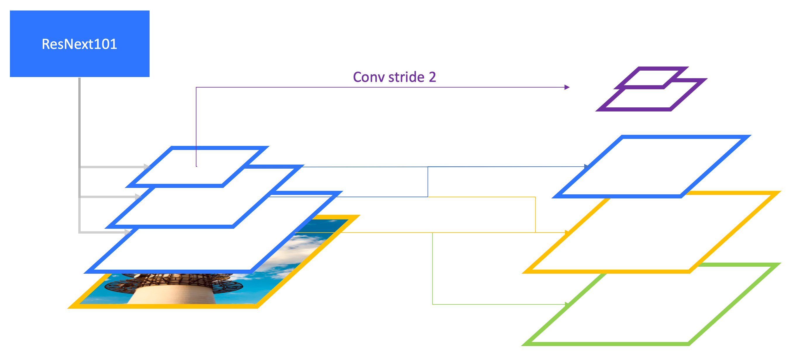
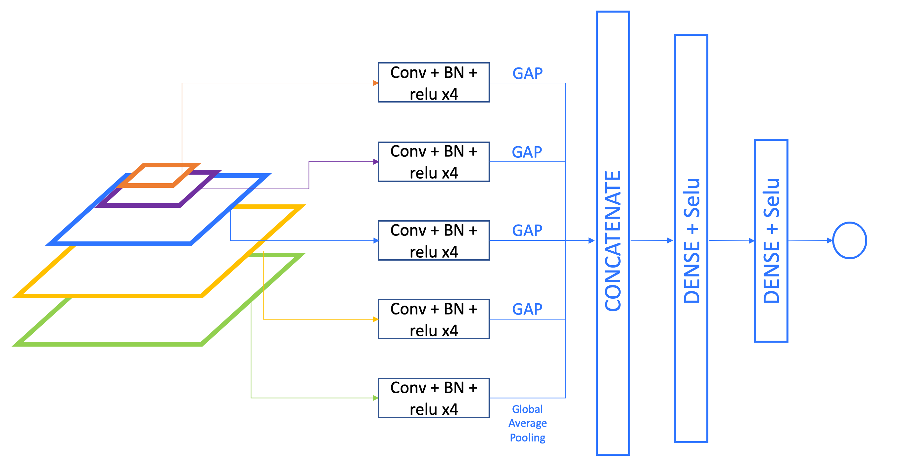
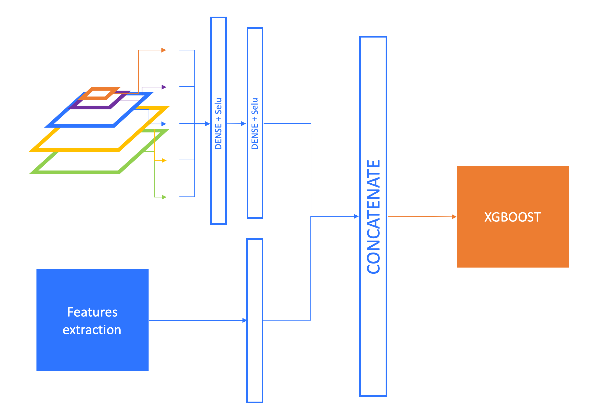
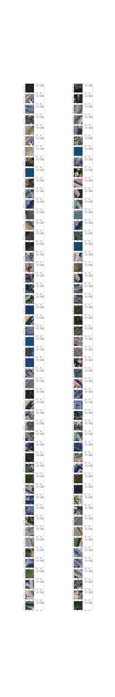
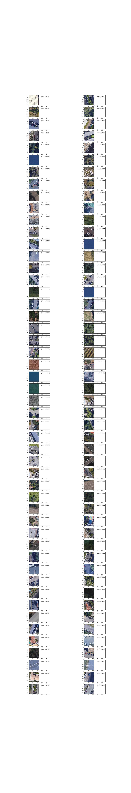

Parking Detection
=================
Total @Booster Challenge - Build a neural network that classify satellite pictures.

Pipeline
-----------
#### Global Architecture
I used a RetinaNet build with ResNext101 as backbone. From backbone I used 7x7 (conv5_block3_out), 14x14 (conv4_block23_out) and 28x28 layers (conv3_block4_out) as feature stage. From this feature stages, I create an FPN and forward each level of this pyramid through a classification model. Then I concatenate each GlobalAveragedPooling vector from each classification model.
This vector is fed to several Dense layers for binary classification.

Then I used the within one position of the top Dense layer and concatenate it withe extracted features from images and fed all that to an XGBoost classifier optimized by Beyesian optimization.

#### RetinaNet

The first thing is to create Feature pyramid from backbone:

Once we created the FP, create one classification model for each features map in the pyramid and concatenate GlobalAveragePooling
vector from these model.

#### Features extraction

I realized features to improve the label decision and moreover replace the threshold, after the sigmoid layer, by a classification.

Features extracted :
* Global mean pixel level
* Share of grey pixel in the picture
* Mean level in Red channel
* Mean level in Green channel
* Mean level in Blue channel     
* 25% quantile level in Red channel
* 25% quantile level in Green channel
* 25% quantile level in Blue channel
* 75% quantile level in Red channel
* 75% quantile level in Green channel
* 75% quantile level in Blue channel
* Standard deviation of the Red channel
* Standard deviation of the Green channel
* Standard deviation of the Blue channel

#### Classification

Results
-------------
Results on val set :  
  

Results on test set :  

Finally, I obtained 98,33% of accuracy on the test set.

## Author

* **HALLOUARD Yann** TOTAL SA
