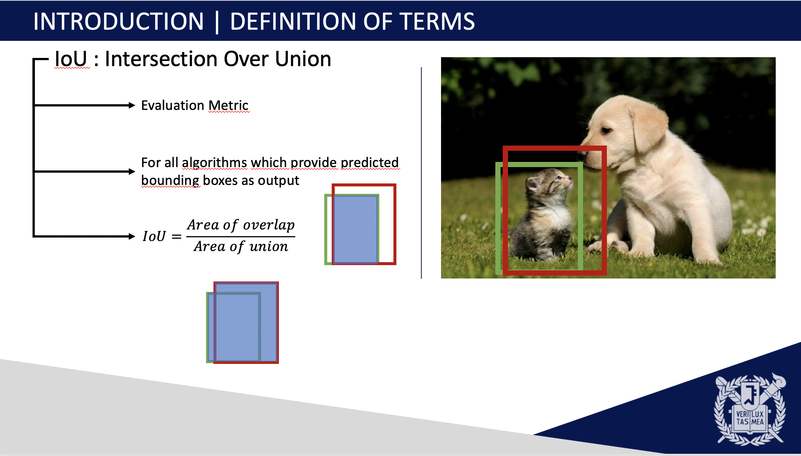
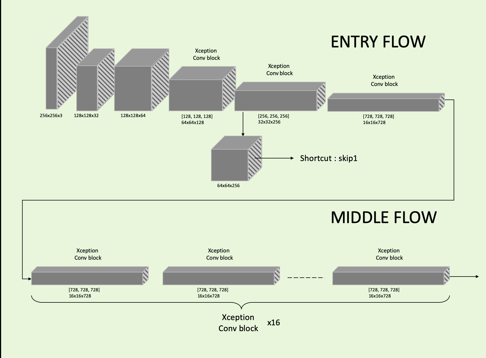
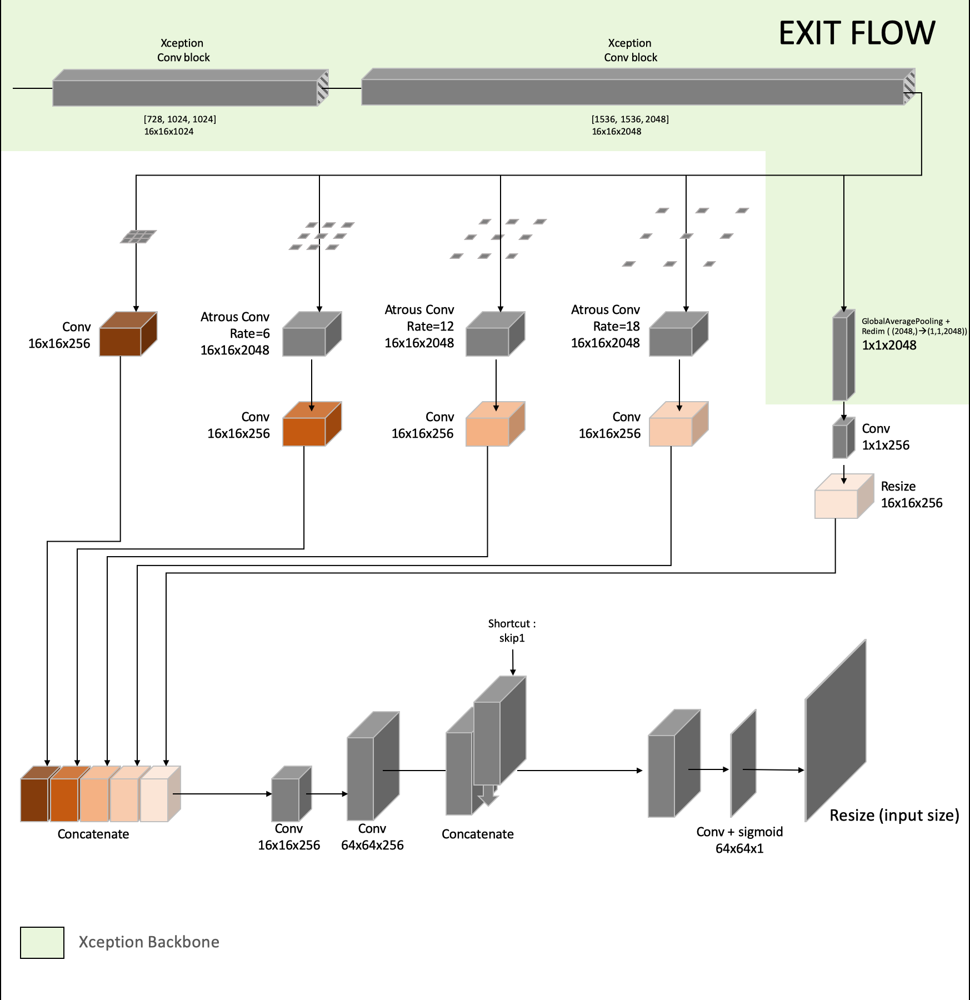
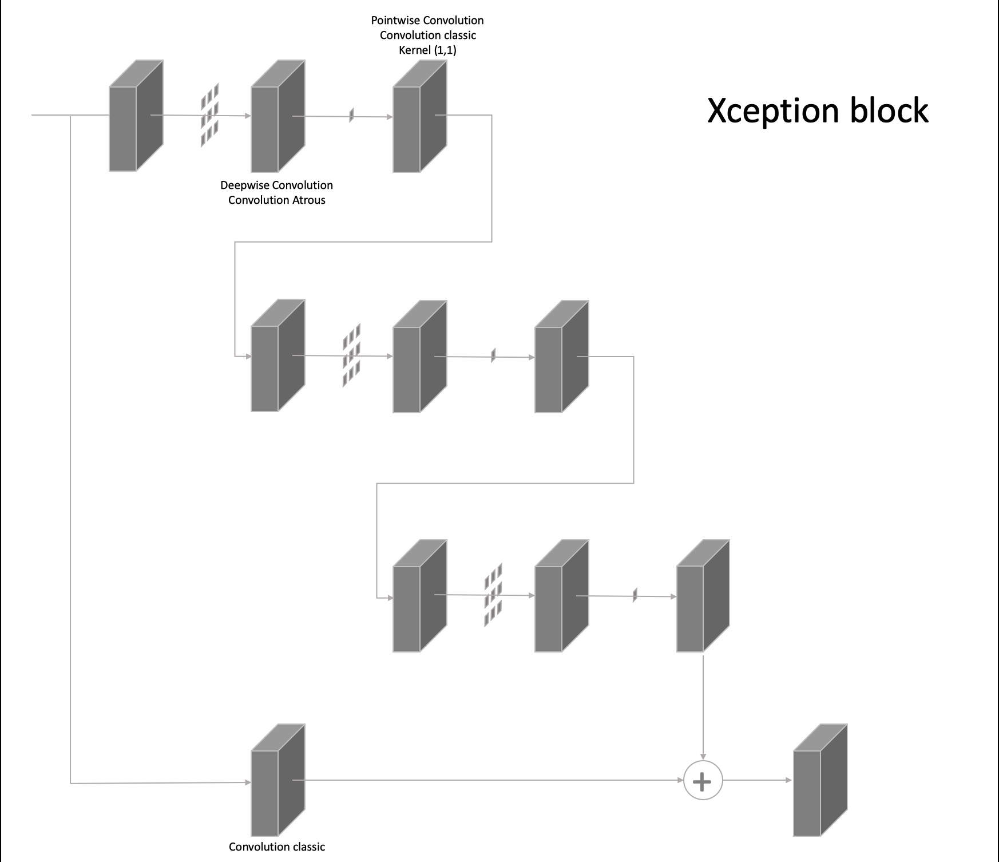
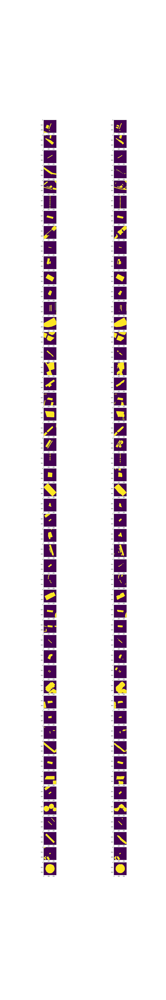
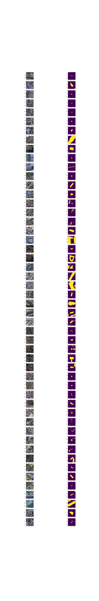

BoosterChallenge-Parking_Segmentation
=================
Booster Challenge on site https://datascience.total.com --- Step 2 : Parking semantic segmentation, We aim to get the surface of parking on each pictures.

Pipeline
-----------
#### Global Architecture

I used a DeepLabv3+ from Microsoft build with Xception as backbone and pre trained on cityscape. We re-trained the whole network and used the the cityscape weights as initializers.

#### Losses
The loss used for the Challenge is the symmetric difference :

  

That can be computed by this loss :

  

Values from this loss are too high, so a parameter 'smooth' is added to the loss. (here the smooth parameter is set as 100 000)

  

However, it seems that when your using this loss to train the network, the first thing it learns is to reduce the prediction area and output empty masks.

In order to let the network learn features in the backbone part, we firstly trained the network with the BinaryCrossEntropy Loss:

  

When the iou metric slow to improve, we change the loss to the iou_loss. It allows the network to better learn the mask reconstruction part.

  

To monitor the training we used the iou metric and the challenge loss as a metric. This is an extract of a presentation of YOLO network I've done in SNU:

When the validation iou metric stop increasing (around 68%), we again change the loss to the Challenge smoothed loss. It doesn't really improve the IOU but it improve the challenge metric.

For instance, the IOU remains around 68% whereas the Challenge metric goes from 125 000 to 114 000 for the validation set.

#### DeepLabv3+

The Microsoft DeepLabv3+ can be divided into 3 parts :
- Entry
- Middle
- Exit

So as to simplify the comprehension, I simplify the upper schema.

The skip1 shortcut is very useful because it helps gradient back propagation and it allows the network to use features form the backbone part for the output mask construction.

Here is another schema to explain what is a Xception Conv Block:

If you want to learn more about Atrous convolution, [here](https://towardsdatascience.com/review-dilated-convolution-semantic-segmentation-9d5a5bd768f5) is a great medium article from Sik-Ho Tsang published in Nov 17, 2018.

#### Results
Results on Validation Set :

Results on Test Set :

## Author

* **HALLOUARD Yann** TOTAL SA
